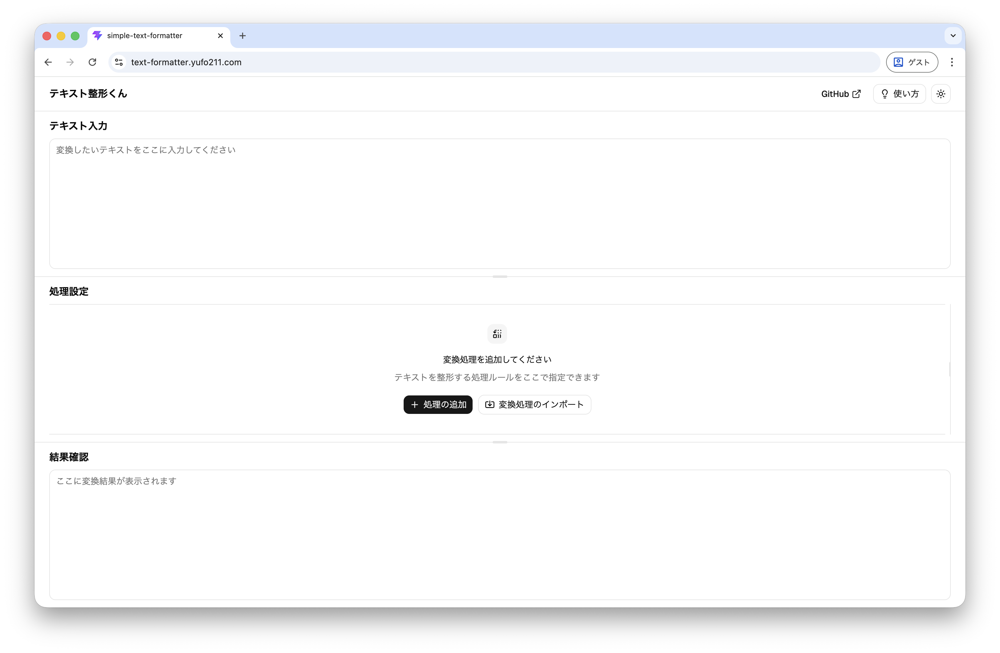
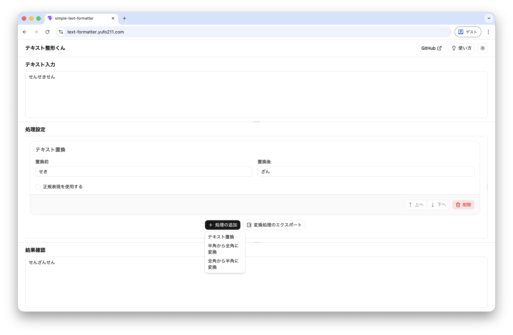

# simple-text-formatter

変換設定を出力して再利用できるテキスト整形ツール

## ✨️ 特徴

- 変換設定のエクスポート・インポートができます
  - 何回も同じ設定で変換するときに便利です
  - JSON形式での出力となります
- テキスト置換では正規表現を使うこともできます
- 半角全角間の変換処理では対象を以下から複数選択することができます
  - 数字
  - アルファベット
  - カタカナ
  - 空白
  - 記号
- 変換処理は上から実行されるので、少し複雑な変換処理にも対応できます

## 🖼️ イメージ

## 🛠️ 開発者向け情報

### ファイル構成

- Webインターフェースは`apps/web`
- 内部の変換処理は`packages/core`

に記述されています。使用したライブラリなどはそれぞれのディレクトリの`package.json`をご覧ください。

### 変換設定の出力形式

JSONファイルのスキーマは[replacementSchema.ts](packages/core/src/types/replacementSchema.ts)内で定義されている`ReplacementSchema`から各変換処理の`id`を抜いたものになります。

`id`は並べ替え処理などの際に内部的に使用されるものなので、一意であればどんな文字列でも動作するはずです。
（本アプリケーションの内部ではuuid v4を使用しています。）

### Issue / Pull Requestについて

Issue、Pull Requestはどちらも大歓迎です。
ベストエフォートでの対応となるため、必ずしも対応できるわけではないことはご了承ください。
